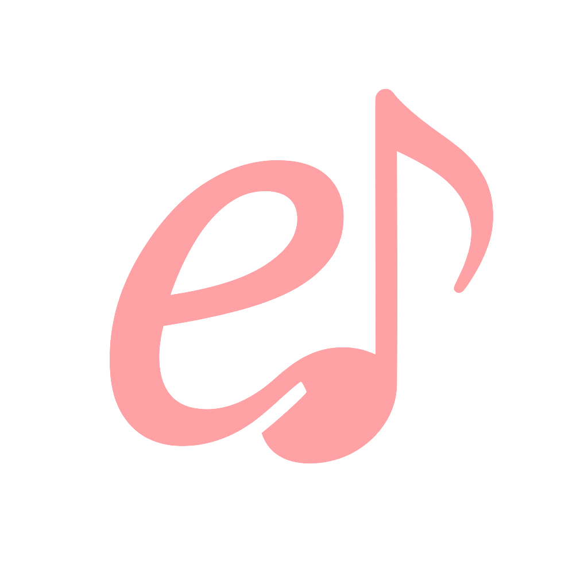

<h1 align="center">
   
  
   
  <b>Eny</b>
   
</h1>

rhythm "game" in Nim and raylib

press the notes when they reach your arrows

i've included some premade (although half-assed) charts and songs that i made by pressing keys to the music with my eyes closed.

i made this because i was inspired by a fairly small youtuber who made a rhythm game based on Bocchi the Rock! (which was very cool and interesting), and i thought "i could totally do that... probably"

# how to make charts

when you start for the first time, a file named `eny.json` is created.

go into that, and change the `recordingMode` field from `false` to `true`

now when you start, your inputs are recorded for charting

pressing `G` will save your song in "assets/chart/.."; if you want to play it i recommend renaming it for easier rememberance

# how to load different charges

again in the `eny.json` file, there is a `chartToLoad` field which refers to the name of a chart in `assets/chart/`

change it to play a different track

ensure you have recording mode off too

# how to rebind keys

once again, edit `eny.json`

the field named `keybinds` are your binds, they go from left to right based on the arrows in game.

edit them however you wish, not all keybinds are supported though

# Licensing

Notesheet art by DariDevTM
