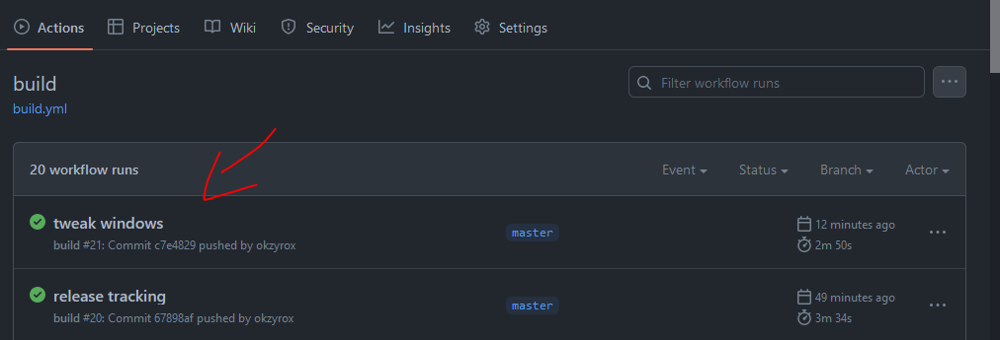
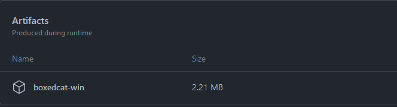

<h1 align="center">
   
  
   
  <b>Eny</b>
   
</h1>

rhythm "game" in Nim and raylib

press the notes when they reach your arrows

showcase: [Video](https://www.youtube.com/watch?v=kJFx3VM5QF4)

i've included some premade (although half-assed) charts and songs that i made by pressing keys to the music with my eyes closed.

i made this because i was inspired by a fairly small youtuber who made a rhythm game based on Bocchi the Rock! (which was very cool and interesting), and i thought "i could totally do that... probably"

# Download

there are no stable builds of the game at the moment, however you can download the latest commit version from the actions tab

 

 
find the file then download
 

 

(the above image is not the name of the file, the file is just called `eny` )

# How to...

## how to add songs (to make charts with)

inside the folder `content/music` is where all the songs that can be used for the game are stored

inside `eny.json` the `recordingModeSong` configuration is the name of the song you want to use when recording

currently only `.mp3` music files are supported.

## how to rebind keys

once again, edit `eny.json`

the field named `keybinds` are your binds, they go from left to right based on the arrows in game.

edit them however you wish, not all keybinds are supported though

key lookup:
- A-Z: `A-Z`
- 0-9: `0-9`
- Arrow Keys: `UP`, `LEFT`, `DOWN`, `RIGHT`

# Licensing

Notesheet art by DariDevTM
